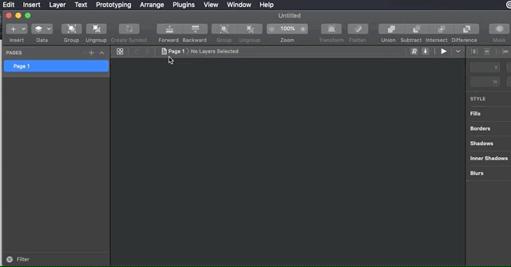
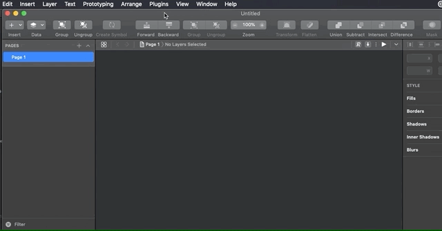

# Sketch Export Prefrences

Share your Sketch export preferences with your coworkers or colleagues.

## Installation

- [Download](../../releases/latest/download/sketch-export-preferences.sketchplugin.zip) the latest release of the plugin
- Un-zip
- Double-click on sketch-export-preferences.sketchplugin

## How it works

#### Export

Save your preferences to a json file.

#### Import

Select a json file exported using this plugin and boom! You have now added new export preferences.

